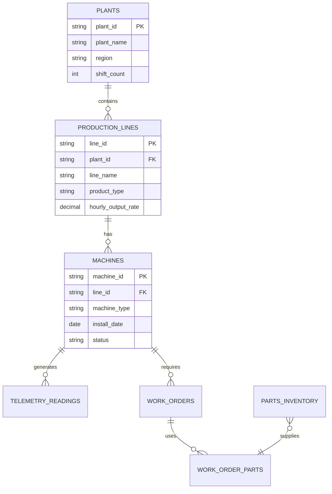

# L300-01 — Data Exploration Methodology

**Customer:** Volta Industrial  
**Prepared for:** Engineers & Implementers  
**Classification:** Level 300 — Detailed Design  
**Scope:** Data profiling, ERD generation, key analysis, integrity validation  

---

## 1. Purpose

Before building the UC Business Semantics layer, we must deeply understand Volta's existing data landscape. This document defines the systematic methodology for exploring their lakehouse — producing ERDs, identifying keys and relationships, validating integrity, and surfacing candidates for Domains, Metric Views, and Pages.

**Key Principle:** This methodology is metadata-driven and reusable. The same scripts and patterns apply to any manufacturing customer's lakehouse.

---

## 2. Exploration Phases

### Phase Overview

| Phase | Output | Purpose |
|-------|--------|---------|
| 1. Catalog Discovery | Table inventory | What exists, where, freshness |
| 2. Table Profiling | Column-level statistics | Data quality, completeness, distributions |
| 3. Key Analysis | PK/FK candidates | Entity identification, join paths |
| 4. Integrity Validation | Integrity report | Referential integrity, orphans, duplicates |
| 5. ERD Generation | Silver + Gold ERDs | Visual relationship map |
| 6. Semantic Mapping | Domain/Metric/Page candidates | Input to UC Semantics build |

---

## 3. Phase 1: Catalog Discovery

### 3.1 Table Inventory Script

```sql
-- Discover all tables in the Volta catalog across medallion layers
SELECT 
  table_catalog,
  table_schema,
  table_name,
  table_type,
  created,
  last_altered,
  comment
FROM system.information_schema.tables
WHERE table_catalog = 'volta_industrial'
ORDER BY table_schema, table_name;
```

### 3.2 Schema Classification

Classify schemas into medallion layers:

| Pattern | Layer | Expected Content |
|---------|-------|-----------------|
| `*_bronze`, `raw_*`, `landing_*` | Bronze | Raw ingested data, minimal transformation |
| `*_silver`, `cleaned_*`, `conformed_*` | Silver | Cleaned, typed, keyed entities |
| `*_gold`, `analytics_*`, `metrics_*` | Gold | Aggregated metrics, business-level views |
| `*_platinum`, `serving_*` | Serving | Pre-computed for consumption |

### 3.3 Freshness Assessment

```sql
-- Check data freshness for each table
-- Adapt timestamp column name per table
SELECT 
  table_name,
  MAX(event_timestamp) as latest_record,
  DATEDIFF(CURRENT_DATE(), MAX(event_timestamp)) as days_stale,
  COUNT(*) as row_count
FROM volta_industrial.{schema}.{table}
GROUP BY table_name;
```

---

## 4. Phase 2: Table Profiling

### 4.1 Column-Level Statistics

For each table, generate:

```sql
-- Column profiling template (adapt per table)
SELECT
  '{table_name}' as table_name,
  '{column_name}' as column_name,
  COUNT(*) as total_rows,
  COUNT(DISTINCT `{column_name}`) as distinct_values,
  COUNT(*) - COUNT(`{column_name}`) as null_count,
  ROUND((COUNT(*) - COUNT(`{column_name}`)) / COUNT(*) * 100, 2) as null_pct,
  MIN(`{column_name}`) as min_value,
  MAX(`{column_name}`) as max_value
FROM volta_industrial.{schema}.{table};
```

### 4.2 Profiling Metrics

| Metric | What It Tells Us |
|--------|-----------------|
| Distinct count / Total rows | Cardinality ratio → key candidate indicator |
| Null percentage | Completeness → required vs. optional |
| Min/Max | Range → data type validation |
| Value distribution | Skew → potential partition key |
| Pattern analysis (strings) | Format consistency → natural key candidate |

### 4.3 Granularity Detection

```sql
-- Determine table grain by finding the minimal column set with unique rows
-- Start with suspected grain columns and verify
SELECT 
  COUNT(*) as total_rows,
  COUNT(DISTINCT CONCAT_WS('|', col1, col2, col3)) as distinct_combinations
FROM volta_industrial.{schema}.{table};
-- If total_rows == distinct_combinations, this is the grain
```

**Granularity Documentation Template:**

| Table | Grain | Grain Columns | Verified |
|-------|-------|---------------|----------|
| `machine_telemetry` | One row per machine per timestamp | `machine_id`, `reading_timestamp` | ☐ |
| `production_runs` | One row per run | `run_id` | ☐ |
| `work_orders` | One row per work order | `work_order_id` | ☐ |

---

## 5. Phase 3: Key Analysis

### 5.1 Key Types to Identify

| Key Type | Definition | Detection Method |
|----------|-----------|-----------------|
| **Natural Key** | Business-meaningful identifier | High cardinality, no nulls, stable over time |
| **Surrogate Key** | System-generated identifier | UUID/sequence pattern, always unique |
| **Composite Key** | Multi-column uniqueness | No single column is unique, but combination is |
| **Primary Key (PK)** | Chosen unique identifier for the table | Natural or surrogate, enforces entity integrity |
| **Foreign Key (FK)** | Reference to another table's PK | Column name matches PK pattern, values subset of PK |

### 5.2 PK Candidate Detection

```sql
-- Check if a column is a valid PK candidate
-- Criteria: unique, not null, stable
SELECT 
  '{column_name}' as candidate_pk,
  COUNT(*) as total_rows,
  COUNT(DISTINCT `{column_name}`) as distinct_values,
  COUNT(*) - COUNT(`{column_name}`) as null_count,
  CASE 
    WHEN COUNT(*) = COUNT(DISTINCT `{column_name}`) 
     AND COUNT(*) - COUNT(`{column_name}`) = 0 
    THEN 'VALID PK CANDIDATE'
    ELSE 'NOT A PK CANDIDATE'
  END as assessment
FROM volta_industrial.{schema}.{table};
```

### 5.3 FK Candidate Detection

```sql
-- Check if column values are a subset of another table's PK
-- (referential integrity check)
SELECT 
  COUNT(DISTINCT a.`{fk_column}`) as fk_distinct_values,
  COUNT(DISTINCT b.`{pk_column}`) as pk_distinct_values,
  COUNT(DISTINCT a.`{fk_column}`) - 
    COUNT(DISTINCT CASE WHEN b.`{pk_column}` IS NOT NULL THEN a.`{fk_column}` END) as orphan_count
FROM volta_industrial.{schema}.{child_table} a
LEFT JOIN volta_industrial.{schema}.{parent_table} b
  ON a.`{fk_column}` = b.`{pk_column}`;
```

### 5.4 Composite Key Detection

```sql
-- When no single column is unique, test combinations
SELECT 
  COUNT(*) as total_rows,
  COUNT(DISTINCT CONCAT_WS('|', `col1`, `col2`)) as composite_distinct
FROM volta_industrial.{schema}.{table};
-- Iterate adding columns until composite_distinct == total_rows
```

---

## 6. Phase 4: Integrity Validation

### 6.1 Entity Integrity

Every table must have a defined primary key with no nulls and no duplicates.

```sql
-- Entity integrity check
SELECT 
  '{table_name}' as table_name,
  '{pk_columns}' as pk_columns,
  COUNT(*) as total_rows,
  COUNT(*) - COUNT(DISTINCT CONCAT_WS('|', {pk_columns})) as duplicate_pks,
  SUM(CASE WHEN {pk_column_1} IS NULL THEN 1 ELSE 0 END) as null_pks
FROM volta_industrial.{schema}.{table};
```

### 6.2 Referential Integrity

Every FK value must exist in the referenced PK table (or be null if the relationship is optional).

```sql
-- Referential integrity check
SELECT 
  '{child_table}.{fk_column}' as relationship,
  COUNT(*) as total_fk_rows,
  SUM(CASE WHEN parent.`{pk_column}` IS NULL AND child.`{fk_column}` IS NOT NULL THEN 1 ELSE 0 END) as orphan_rows,
  ROUND(SUM(CASE WHEN parent.`{pk_column}` IS NULL AND child.`{fk_column}` IS NOT NULL THEN 1 ELSE 0 END) / COUNT(*) * 100, 2) as orphan_pct
FROM volta_industrial.{schema}.{child_table} child
LEFT JOIN volta_industrial.{schema}.{parent_table} parent
  ON child.`{fk_column}` = parent.`{pk_column}`;
```

### 6.3 Integrity Report Template

| Relationship | Child Table | FK Column | Parent Table | PK Column | Orphan Count | Orphan % | Status |
|-------------|-------------|-----------|--------------|-----------|--------------|----------|--------|
| Machine → Plant | `machine_telemetry` | `plant_id` | `plants` | `plant_id` | 0 | 0% | ✅ |
| Work Order → Machine | `work_orders` | `machine_id` | `machines` | `machine_id` | 12 | 0.3% | ⚠️ |

---

## 7. Phase 5: ERD Generation

### 7.1 ERD Format (Mermaid Markdown)

ERDs are generated as Mermaid diagrams embedded in markdown for portability.

```markdown

```

### 7.2 ERD Scope

| ERD | Tables Included | Purpose |
|-----|----------------|---------|
| Silver Model | All conformed entity tables | Understand data relationships |
| Gold Model | Aggregated/metric tables | Understand pre-computed analytics |
| Cross-layer | Key tables from both | Show lineage from entity to metric |

---

## 8. Phase 6: Semantic Mapping

### 8.1 Domain Candidates

Based on table clustering and business function:

| Candidate Domain | Tables | Business Function |
|-----------------|--------|-------------------|
| **Production** | Lines, runs, schedules, OEE | "How are we running?" |
| **Maintenance** | Work orders, machine health, PdM scores | "What needs fixing?" |
| **Supply Chain** | Parts inventory, suppliers, lead times | "Do we have what we need?" |

### 8.2 Metric View Candidates

Map persona questions to potential Metric Views:

| Persona Question | Candidate Metric View | Source Tables |
|-----------------|----------------------|---------------|
| "Which lines are trending toward a stop?" | `line_risk_score` | telemetry, PdM model output |
| "Cost of pulling now vs. running?" | `downtime_cost_comparison` | line output rates, maintenance costs |
| "Did a plant manager make a different call?" | `decision_outcomes` | decisions (writable), actual downtime |
| "What does this cost at 8 plants?" | `ai_spend_by_plant` | AI Gateway logs |

### 8.3 UC Page Candidates

| Page Category | Candidate Pages |
|---------------|----------------|
| **Industry KPIs** | OEE, MTBF, MTTR, Availability, Performance, Quality |
| **Volta-specific** | Downtime cost model, risk scoring methodology, shift patterns |
| **Operational** | Plant hierarchy, line classification, machine types |

---

## 9. Tooling & Automation

### 9.1 Reusable Scripts

All exploration scripts are parameterized and reusable:

| Script | Input | Output |
|--------|-------|--------|
| `catalog_discovery.sql` | Catalog name | Table inventory CSV |
| `table_profiler.py` | Table list | Column statistics JSON |
| `key_analyzer.py` | Table list | PK/FK candidates JSON |
| `integrity_checker.py` | Relationship list | Integrity report MD |
| `erd_generator.py` | Key analysis output | Mermaid ERD MD |
| `semantic_mapper.py` | All above | Domain/Metric/Page candidates MD |

### 9.2 Output Artifacts

All outputs are markdown files stored in the `assets/` directory:

- `assets/erd-silver.md` — Silver model ERD
- `assets/erd-gold.md` — Gold model ERD  
- `assets/data-profile-report.md` — Full profiling results
- `assets/key-analysis-report.md` — PK/FK candidates and integrity
- `assets/semantic-candidates.md` — Domain, Metric View, and Page candidates

---

## 10. Manufacturing Industry KPI Reference

### Standard Manufacturing KPIs (for UC Pages)

| KPI | Definition | Formula | Category |
|-----|-----------|---------|----------|
| **OEE** | Overall Equipment Effectiveness | Availability × Performance × Quality | Production |
| **Availability** | % of planned time the line is running | (Planned Time - Downtime) / Planned Time | Production |
| **Performance** | Speed relative to ideal | (Ideal Cycle Time × Total Count) / Run Time | Production |
| **Quality** | Good parts ratio | Good Count / Total Count | Production |
| **MTBF** | Mean Time Between Failures | Total Operating Time / Number of Failures | Maintenance |
| **MTTR** | Mean Time To Repair | Total Repair Time / Number of Repairs | Maintenance |
| **MTTF** | Mean Time To Failure | Total Operating Time / Number of Failures (non-repairable) | Maintenance |
| **Planned Maintenance %** | Ratio of planned vs. total maintenance | Planned Hours / Total Maintenance Hours | Maintenance |
| **Schedule Compliance** | Work orders completed on time | Completed On-Time / Total Scheduled | Maintenance |
| **Parts Availability** | Parts in stock when needed | Parts Available / Parts Requested | Supply Chain |
| **Inventory Turns** | How fast inventory cycles | COGS / Average Inventory | Supply Chain |
| **Supplier Lead Time** | Days from order to receipt | AVG(Receipt Date - Order Date) | Supply Chain |
| **First Pass Yield** | Units passing QC first time | First Pass Good / Total Produced | Quality |
| **Scrap Rate** | Material wasted | Scrap Weight / Total Material Input | Quality |
| **Downtime Cost** | Financial impact of stops | Downtime Hours × Hourly Line Cost | Financial |
| **Cost Per Unit** | Total cost divided by output | Total Production Cost / Units Produced | Financial |

---

## 11. Execution Checklist

- [ ] Connect to Volta's Unity Catalog
- [ ] Run catalog discovery, classify schemas
- [ ] Profile all Silver tables (columns, stats, granularity)
- [ ] Profile all Gold tables
- [ ] Identify PK candidates for each table
- [ ] Identify FK candidates (cross-table relationships)
- [ ] Validate entity integrity (no null/duplicate PKs)
- [ ] Validate referential integrity (no orphan FKs)
- [ ] Generate Silver ERD (Mermaid)
- [ ] Generate Gold ERD (Mermaid)
- [ ] Map tables to candidate Domains
- [ ] Map persona questions to candidate Metric Views
- [ ] Document UC Page candidates (industry + Volta-specific)
- [ ] Compile all outputs into `assets/` directory
- [ ] Review with team before proceeding to L300-02 (UC Semantics)

---

*Document Level: L300 — Detailed Design*  
*Audience: Data engineers, analytics engineers, platform engineers*  
*Prerequisite: Access to Volta's Unity Catalog*  
*Next: [L300-02 — UC Business Semantics](L300-02-uc-semantics.md)*
