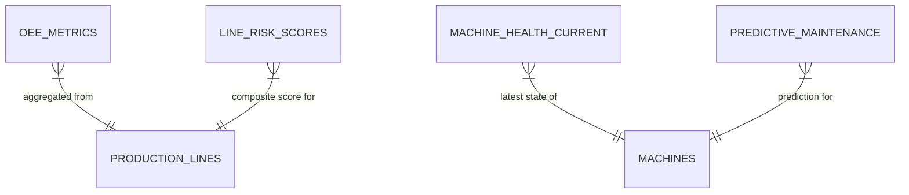

# Gold Model ERD

**Status:** Placeholder — to be generated during data exploration (L300-01)

---

## Instructions

This ERD will be generated after connecting to Volta's Unity Catalog and completing the data exploration phase. The Gold model shows pre-aggregated metrics and their relationships.

## Expected Content

- Mermaid diagram of all Gold-layer metric/aggregate tables
- Lineage from Silver entities to Gold metrics
- Grain documentation (what one row represents)
- Refresh frequency annotations

## Template

---

*Generated by: Data Exploration Phase (L300-01)*  
*Last updated: Pending*
