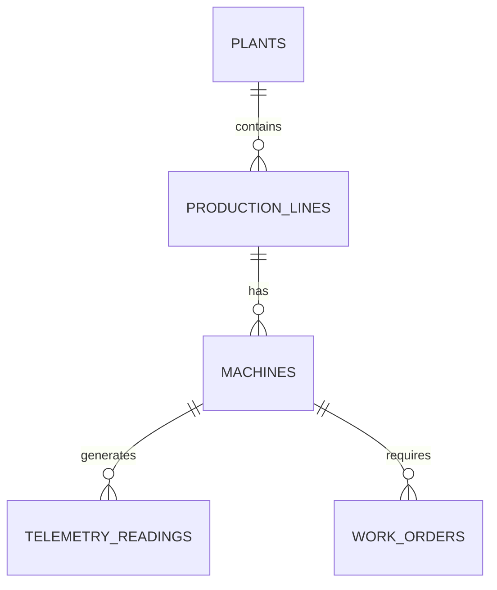

# Silver Model ERD

**Status:** Placeholder — to be generated during data exploration (L300-01)

---

## Instructions

This ERD will be generated after connecting to Volta's Unity Catalog and completing the data exploration phase. The methodology is defined in [L300-01 — Data Exploration](../L300-detailed-design/L300-01-data-exploration.md).

## Expected Content

- Mermaid diagram of all Silver-layer entity tables
- Table definitions with PK/FK annotations
- Relationship cardinality (1:1, 1:N, M:N)
- Grain documentation per table

## Template

---

*Generated by: Data Exploration Phase (L300-01)*  
*Last updated: Pending*
