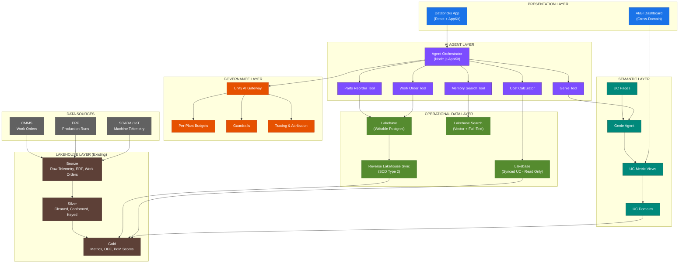

# Volta Industrial — High-Level Platform Architecture

```mermaid
graph TB
    subgraph Presentation["PRESENTATION LAYER"]
        direction LR
        APP["Databricks App<br/>(React + AppKit)"]
        AIBI["AI/BI Dashboard<br/>(Cross-Domain)"]
    end

    subgraph Agent["AI AGENT LAYER"]
        direction LR
        ORCH["Agent Orchestrator<br/>(Node.js AppKit)"]
        GENIE_TOOL["Genie Tool"]
        COST_TOOL["Cost Calculator"]
        WO_TOOL["Work Order Tool"]
        PARTS_TOOL["Parts Reorder Tool"]
        MEM_TOOL["Memory Search Tool"]
    end

    subgraph Governance["GOVERNANCE LAYER"]
        direction LR
        GATEWAY["Unity AI Gateway"]
        BUDGETS["Per-Plant Budgets"]
        GUARDRAILS["Guardrails"]
        TRACING["Tracing & Attribution"]
    end

    subgraph Semantic["SEMANTIC LAYER"]
        direction LR
        DOMAINS["UC Domains"]
        METRICS["UC Metric Views"]
        PAGES["UC Pages"]
        GENIE["Genie Agent"]
    end

    subgraph Operational["OPERATIONAL DATA LAYER"]
        direction LR
        SYNC_RO["Lakebase<br/>(Synced UC - Read Only)"]
        WRITE_PG["Lakebase<br/>(Writable Postgres)"]
        SEARCH["Lakebase Search<br/>(Vector + Full-Text)"]
        REV_SYNC["Reverse Lakehouse Sync<br/>(SCD Type 2)"]
    end

    subgraph Lakehouse["LAKEHOUSE LAYER (Existing)"]
        direction LR
        BRONZE["Bronze<br/>Raw Telemetry, ERP, Work Orders"]
        SILVER["Silver<br/>Cleaned, Conformed, Keyed"]
        GOLD["Gold<br/>Metrics, OEE, PdM Scores"]
    end

    subgraph Sources["DATA SOURCES"]
        direction LR
        SCADA["SCADA / IoT<br/>Machine Telemetry"]
        ERP["ERP<br/>Production Runs"]
        CMMS["CMMS<br/>Work Orders"]
    end

    %% Connections
    APP --> ORCH
    AIBI --> METRICS
    ORCH --> GENIE_TOOL
    ORCH --> COST_TOOL
    ORCH --> WO_TOOL
    ORCH --> PARTS_TOOL
    ORCH --> MEM_TOOL
    ORCH --> GATEWAY
    GENIE_TOOL --> GENIE
    GATEWAY --> BUDGETS
    GATEWAY --> GUARDRAILS
    GATEWAY --> TRACING
    GENIE --> METRICS
    METRICS --> DOMAINS
    DOMAINS --> GOLD
    PAGES --> GENIE
    COST_TOOL --> SYNC_RO
    WO_TOOL --> WRITE_PG
    PARTS_TOOL --> WRITE_PG
    MEM_TOOL --> SEARCH
    SYNC_RO --> GOLD
    WRITE_PG --> REV_SYNC
    REV_SYNC --> GOLD
    BRONZE --> SILVER
    SILVER --> GOLD
    SCADA --> BRONZE
    ERP --> BRONZE
    CMMS --> BRONZE

    %% Styling
    classDef presentation fill:#1a73e8,stroke:#0d47a1,color:#fff
    classDef agent fill:#7c4dff,stroke:#4a148c,color:#fff
    classDef governance fill:#e65100,stroke:#bf360c,color:#fff
    classDef semantic fill:#00897b,stroke:#004d40,color:#fff
    classDef operational fill:#558b2f,stroke:#33691e,color:#fff
    classDef lakehouse fill:#5d4037,stroke:#3e2723,color:#fff
    classDef sources fill:#616161,stroke:#424242,color:#fff

    class APP,AIBI presentation
    class ORCH,GENIE_TOOL,COST_TOOL,WO_TOOL,PARTS_TOOL,MEM_TOOL agent
    class GATEWAY,BUDGETS,GUARDRAILS,TRACING governance
    class DOMAINS,METRICS,PAGES,GENIE semantic
    class SYNC_RO,WRITE_PG,SEARCH,REV_SYNC operational
    class BRONZE,SILVER,GOLD lakehouse
    class SCADA,ERP,CMMS sources
```
