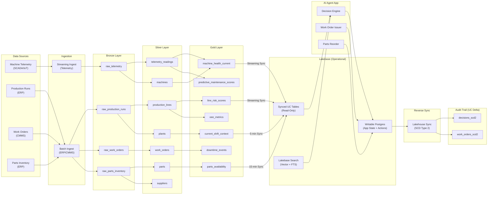

# Volta Industrial — Data Flow Architecture

```mermaid
flowchart LR
    subgraph Sources["Data Sources"]
        S1["Machine Telemetry<br/>(SCADA/IoT)"]
        S2["Production Runs<br/>(ERP)"]
        S3["Work Orders<br/>(CMMS)"]
        S4["Parts Inventory<br/>(ERP)"]
    end

    subgraph Ingest["Ingestion"]
        I1["Streaming Ingest<br/>(Telemetry)"]
        I2["Batch Ingest<br/>(ERP/CMMS)"]
    end

    subgraph Bronze["Bronze Layer"]
        B1["raw_telemetry"]
        B2["raw_production_runs"]
        B3["raw_work_orders"]
        B4["raw_parts_inventory"]
    end

    subgraph Silver["Silver Layer"]
        SV1["machines"]
        SV2["production_lines"]
        SV3["plants"]
        SV4["telemetry_readings"]
        SV5["work_orders"]
        SV6["parts"]
        SV7["suppliers"]
    end

    subgraph Gold["Gold Layer"]
        G1["machine_health_current"]
        G2["line_risk_scores"]
        G3["oee_metrics"]
        G4["predictive_maintenance_scores"]
        G5["parts_availability"]
        G6["current_shift_context"]
        G7["downtime_events"]
    end

    subgraph Lakebase["Lakebase (Operational)"]
        direction TB
        LB_RO["Synced UC Tables<br/>(Read-Only)"]
        LB_RW["Writable Postgres<br/>(App State + Actions)"]
        LB_SEARCH["Lakebase Search<br/>(Vector + FTS)"]
    end

    subgraph App["AI Agent App"]
        A1["Decision Engine"]
        A2["Work Order Issuer"]
        A3["Parts Reorder"]
    end

    subgraph Reverse["Reverse Sync"]
        RS["Lakehouse Sync<br/>(SCD Type 2)"]
    end

    subgraph Audit["Audit Trail (UC Delta)"]
        AU1["decisions_scd2"]
        AU2["work_orders_scd2"]
    end

    %% Source to Ingest
    S1 --> I1
    S2 --> I2
    S3 --> I2
    S4 --> I2

    %% Ingest to Bronze
    I1 --> B1
    I2 --> B2
    I2 --> B3
    I2 --> B4

    %% Bronze to Silver
    B1 --> SV4
    B1 --> SV1
    B2 --> SV2
    B2 --> SV3
    B3 --> SV5
    B4 --> SV6
    B4 --> SV7

    %% Silver to Gold
    SV4 --> G1
    SV4 --> G4
    SV1 --> G1
    SV2 --> G2
    SV2 --> G3
    SV5 --> G7
    SV6 --> G5
    SV3 --> G6

    %% Gold to Lakebase (Forward Sync)
    G1 -->|"Streaming Sync"| LB_RO
    G2 -->|"Streaming Sync"| LB_RO
    G5 -->|"15-min Sync"| LB_RO
    G6 -->|"5-min Sync"| LB_RO

    %% Lakebase to App
    LB_RO --> A1
    LB_SEARCH --> A1
    A1 --> LB_RW
    A2 --> LB_RW
    A3 --> LB_RW

    %% Reverse Sync
    LB_RW --> RS
    RS --> AU1
    RS --> AU2
```
