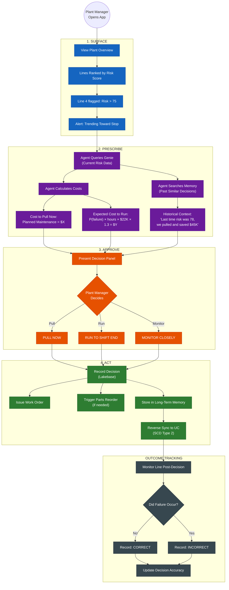

# Volta Industrial — Decision Flow (Hero Question)

```mermaid
flowchart TD
    START(("Plant Manager<br/>Opens App"))
    
    subgraph Surface["1. SURFACE"]
        S1["View Plant Overview"]
        S2["Lines Ranked by Risk Score"]
        S3["Line 4 flagged: Risk > 75"]
        S4["Alert: Trending Toward Stop"]
    end

    subgraph Prescribe["2. PRESCRIBE"]
        P1["Agent Queries Genie<br/>(Current Risk Data)"]
        P2["Agent Calculates Costs"]
        P3["Cost to Pull Now:<br/>Planned Maintenance = $X"]
        P4["Expected Cost to Run:<br/>P(failure) × hours × $22K × 1.3 = $Y"]
        P5["Agent Searches Memory<br/>(Past Similar Decisions)"]
        P6["Historical Context:<br/>'Last time risk was 78,<br/>we pulled and saved $45K'"]
    end

    subgraph Approve["3. APPROVE"]
        A1["Present Decision Panel"]
        A2{"Plant Manager<br/>Decides"}
        A3["PULL NOW"]
        A4["RUN TO SHIFT END"]
        A5["MONITOR CLOSELY"]
    end

    subgraph Act["4. ACT"]
        ACT1["Record Decision<br/>(Lakebase)"]
        ACT2["Issue Work Order"]
        ACT3["Trigger Parts Reorder<br/>(if needed)"]
        ACT4["Store in Long-Term Memory"]
        ACT5["Reverse Sync to UC<br/>(SCD Type 2)"]
    end

    subgraph Outcome["OUTCOME TRACKING"]
        O1["Monitor Line Post-Decision"]
        O2{"Did Failure Occur?"}
        O3["Record: CORRECT"]
        O4["Record: INCORRECT"]
        O5["Update Decision Accuracy"]
    end

    START --> S1
    S1 --> S2
    S2 --> S3
    S3 --> S4
    S4 --> P1
    P1 --> P2
    P2 --> P3
    P2 --> P4
    P1 --> P5
    P5 --> P6
    P3 --> A1
    P4 --> A1
    P6 --> A1
    A1 --> A2
    A2 -->|"Pull"| A3
    A2 -->|"Run"| A4
    A2 -->|"Monitor"| A5
    A3 --> ACT1
    A4 --> ACT1
    A5 --> ACT1
    ACT1 --> ACT2
    ACT1 --> ACT3
    ACT1 --> ACT4
    ACT4 --> ACT5
    ACT5 --> O1
    O1 --> O2
    O2 -->|"No"| O3
    O2 -->|"Yes"| O4
    O3 --> O5
    O4 --> O5

    %% Styling
    classDef surface fill:#1565c0,stroke:#0d47a1,color:#fff
    classDef prescribe fill:#6a1b9a,stroke:#4a148c,color:#fff
    classDef approve fill:#e65100,stroke:#bf360c,color:#fff
    classDef act fill:#2e7d32,stroke:#1b5e20,color:#fff
    classDef outcome fill:#37474f,stroke:#263238,color:#fff

    class S1,S2,S3,S4 surface
    class P1,P2,P3,P4,P5,P6 prescribe
    class A1,A2,A3,A4,A5 approve
    class ACT1,ACT2,ACT3,ACT4,ACT5 act
    class O1,O2,O3,O4,O5 outcome
```
