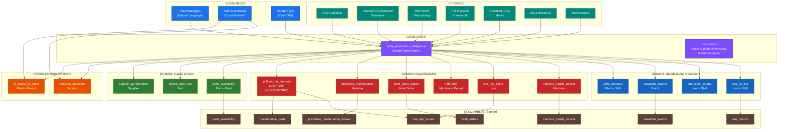

# Volta Industrial — UC Business Semantics Architecture

```mermaid
graph TB
    subgraph Consumers["CONSUMERS"]
        PM["Plant Managers<br/>(Natural Language)"]
        DASH["AI/BI Dashboard<br/>(Cross-Domain)"]
        AGENT["AI Agent App<br/>(Tool Calls)"]
    end

    subgraph GenieLayer["GENIE AGENT"]
        GA["volta_production_intelligence<br/>(Single Genie Agent)"]
        INST["Instructions:<br/>Scope to plant, show costs,<br/>reference pages"]
    end

    subgraph Pages["UC PAGES"]
        PG1["OEE Definition"]
        PG2["Planned vs Unplanned<br/>Downtime"]
        PG3["Risk Score<br/>Methodology"]
        PG4["Pull Decision<br/>Framework"]
        PG5["Downtime Cost<br/>Model"]
        PG6["Plant Hierarchy"]
        PG7["Shift Patterns"]
    end

    subgraph Domain1["DOMAIN: Manufacturing Operations"]
        MV1["oee_by_line<br/>Line × Shift"]
        MV2["production_output<br/>Line × Shift"]
        MV3["downtime_events<br/>Event"]
        MV4["shift_summary<br/>Plant × Shift"]
    end

    subgraph Domain2["DOMAIN: Asset Reliability"]
        MV5["machine_health_current<br/>Machine"]
        MV6["line_risk_score<br/>Line"]
        MV7["mtbf_mttr<br/>Machine × Period"]
        MV8["work_order_status<br/>Work Order"]
        MV9["predictive_maintenance<br/>Machine"]
        MV10["pull_or_run_decision<br/>Line × Shift<br/>(HERO METRIC)"]
    end

    subgraph Domain3["DOMAIN: Supply & Parts"]
        MV11["parts_availability<br/>Part × Plant"]
        MV12["critical_parts_risk<br/>Part"]
        MV13["supplier_performance<br/>Supplier"]
    end

    subgraph CrossDomain["CROSS-DOMAIN METRICS"]
        MV14["decision_outcomes<br/>Decision"]
        MV15["ai_spend_by_plant<br/>Plant × Period"]
    end

    subgraph Gold["GOLD TABLES (Source)"]
        GT1["machine_health_current"]
        GT2["line_risk_scores"]
        GT3["oee_metrics"]
        GT4["predictive_maintenance_scores"]
        GT5["parts_availability"]
        GT6["work_orders"]
        GT7["downtime_events"]
        GT8["maintenance_costs"]
    end

    %% Consumer connections
    PM --> GA
    DASH --> MV14
    DASH --> MV15
    AGENT --> GA

    %% Genie to Metric Views
    GA --> MV1
    GA --> MV2
    GA --> MV3
    GA --> MV4
    GA --> MV5
    GA --> MV6
    GA --> MV7
    GA --> MV8
    GA --> MV9
    GA --> MV10
    GA --> MV11
    GA --> MV12
    GA --> MV13
    GA --> MV14
    GA --> MV15

    %% Pages to Genie
    PG1 --> GA
    PG2 --> GA
    PG3 --> GA
    PG4 --> GA
    PG5 --> GA
    PG6 --> GA
    PG7 --> GA

    %% Metric Views to Gold
    MV1 --> GT3
    MV3 --> GT7
    MV5 --> GT1
    MV6 --> GT2
    MV9 --> GT4
    MV10 --> GT2
    MV10 --> GT8
    MV11 --> GT5
    MV8 --> GT6

    %% Styling
    classDef consumer fill:#1a73e8,stroke:#0d47a1,color:#fff
    classDef genie fill:#7c4dff,stroke:#4a148c,color:#fff
    classDef page fill:#00897b,stroke:#004d40,color:#fff
    classDef domain1 fill:#1565c0,stroke:#0d47a1,color:#fff
    classDef domain2 fill:#c62828,stroke:#b71c1c,color:#fff
    classDef domain3 fill:#2e7d32,stroke:#1b5e20,color:#fff
    classDef cross fill:#e65100,stroke:#bf360c,color:#fff
    classDef gold fill:#5d4037,stroke:#3e2723,color:#fff

    class PM,DASH,AGENT consumer
    class GA,INST genie
    class PG1,PG2,PG3,PG4,PG5,PG6,PG7 page
    class MV1,MV2,MV3,MV4 domain1
    class MV5,MV6,MV7,MV8,MV9,MV10 domain2
    class MV11,MV12,MV13 domain3
    class MV14,MV15 cross
    class GT1,GT2,GT3,GT4,GT5,GT6,GT7,GT8 gold
```
