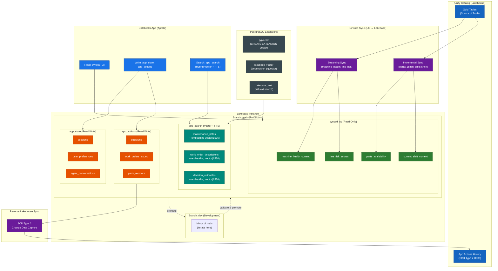

# Volta Industrial — Lakebase Architecture

```mermaid
graph TB
    subgraph UC["Unity Catalog (Lakehouse)"]
        direction LR
        UC_GOLD["Gold Tables<br/>(Source of Truth)"]
        UC_AUDIT["App Actions History<br/>(SCD Type 2 Delta)"]
    end

    subgraph ForwardSync["Forward Sync (UC → Lakebase)"]
        FS1["Streaming Sync<br/>(machine_health, line_risk)"]
        FS2["Incremental Sync<br/>(parts: 15min, shift: 5min)"]
    end

    subgraph Lakebase["Lakebase Instance"]
        subgraph Main["Branch: main (Production)"]
            direction TB
            subgraph SyncedUC["synced_uc (Read-Only)"]
                T1["machine_health_current"]
                T2["line_risk_scores"]
                T3["parts_availability"]
                T4["current_shift_context"]
            end
            subgraph AppState["app_state (Read-Write)"]
                T5["sessions"]
                T6["user_preferences"]
                T7["agent_conversations"]
            end
            subgraph AppActions["app_actions (Read-Write)"]
                T8["decisions"]
                T9["work_orders_issued"]
                T10["parts_reorders"]
            end
            subgraph AppSearch["app_search (Vector + FTS)"]
                T11["maintenance_notes<br/>+ embedding vector(1536)"]
                T12["work_order_descriptions<br/>+ embedding vector(1536)"]
                T13["decision_rationales<br/>+ embedding vector(1536)"]
            end
        end

        subgraph Dev["Branch: dev (Development)"]
            DEV_SCHEMA["Mirror of main<br/>(iterate here)"]
        end
    end

    subgraph Extensions["PostgreSQL Extensions"]
        EXT1["pgvector<br/>(CREATE EXTENSION vector)"]
        EXT2["lakebase_vector<br/>(depends on pgvector)"]
        EXT3["lakebase_text<br/>(full-text search)"]
    end

    subgraph ReverseSync["Reverse Lakehouse Sync"]
        RS["SCD Type 2<br/>Change Data Capture"]
    end

    subgraph App["Databricks App (AppKit)"]
        APP_READ["Read: synced_uc"]
        APP_WRITE["Write: app_state, app_actions"]
        APP_SEARCH["Search: app_search<br/>(Hybrid Vector + FTS)"]
    end

    %% Forward Sync
    UC_GOLD --> FS1
    UC_GOLD --> FS2
    FS1 --> T1
    FS1 --> T2
    FS2 --> T3
    FS2 --> T4

    %% App interactions
    APP_READ --> SyncedUC
    APP_WRITE --> AppState
    APP_WRITE --> AppActions
    APP_SEARCH --> AppSearch

    %% Reverse Sync
    AppActions --> RS
    RS --> UC_AUDIT

    %% Extensions
    Extensions --> AppSearch

    %% Branch relationship
    Main -.->|"promote"| Dev
    Dev -.->|"validate & promote"| Main

    %% Styling
    classDef uc fill:#1565c0,stroke:#0d47a1,color:#fff
    classDef sync fill:#6a1b9a,stroke:#4a148c,color:#fff
    classDef readonly fill:#2e7d32,stroke:#1b5e20,color:#fff
    classDef readwrite fill:#e65100,stroke:#bf360c,color:#fff
    classDef search fill:#00897b,stroke:#004d40,color:#fff
    classDef ext fill:#37474f,stroke:#263238,color:#fff
    classDef app fill:#1a73e8,stroke:#0d47a1,color:#fff

    class UC_GOLD,UC_AUDIT uc
    class FS1,FS2,RS sync
    class T1,T2,T3,T4 readonly
    class T5,T6,T7,T8,T9,T10 readwrite
    class T11,T12,T13 search
    class EXT1,EXT2,EXT3 ext
    class APP_READ,APP_WRITE,APP_SEARCH app
```
