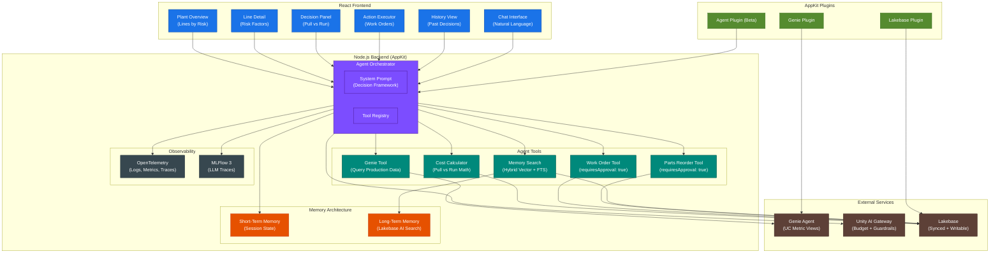

# Volta Industrial — AI Agent Application Architecture

```mermaid
graph TB
    subgraph Frontend["React Frontend"]
        direction LR
        V1["Plant Overview<br/>(Lines by Risk)"]
        V2["Line Detail<br/>(Risk Factors)"]
        V3["Decision Panel<br/>(Pull vs Run)"]
        V4["Action Executor<br/>(Work Orders)"]
        V5["History View<br/>(Past Decisions)"]
        V6["Chat Interface<br/>(Natural Language)"]
    end

    subgraph Backend["Node.js Backend (AppKit)"]
        subgraph AgentOrch["Agent Orchestrator"]
            SYS["System Prompt<br/>(Decision Framework)"]
            TOOLS["Tool Registry"]
        end

        subgraph AgentTools["Agent Tools"]
            TOOL_G["Genie Tool<br/>(Query Production Data)"]
            TOOL_C["Cost Calculator<br/>(Pull vs Run Math)"]
            TOOL_W["Work Order Tool<br/>(requiresApproval: true)"]
            TOOL_P["Parts Reorder Tool<br/>(requiresApproval: true)"]
            TOOL_M["Memory Search<br/>(Hybrid Vector + FTS)"]
        end

        subgraph Memory["Memory Architecture"]
            STM["Short-Term Memory<br/>(Session State)"]
            LTM["Long-Term Memory<br/>(Lakebase AI Search)"]
        end

        subgraph Observability["Observability"]
            OTEL["OpenTelemetry<br/>(Logs, Metrics, Traces)"]
            MLF["MLFlow 3<br/>(LLM Traces)"]
        end
    end

    subgraph External["External Services"]
        GENIE_SVC["Genie Agent<br/>(UC Metric Views)"]
        GATEWAY_SVC["Unity AI Gateway<br/>(Budget + Guardrails)"]
        LB_SVC["Lakebase<br/>(Synced + Writable)"]
    end

    subgraph Plugins["AppKit Plugins"]
        PLG_LB["Lakebase Plugin"]
        PLG_AG["Agent Plugin (Beta)"]
        PLG_GN["Genie Plugin"]
    end

    %% Frontend to Backend
    V1 --> AgentOrch
    V2 --> AgentOrch
    V3 --> AgentOrch
    V4 --> AgentOrch
    V5 --> AgentOrch
    V6 --> AgentOrch

    %% Agent to Tools
    AgentOrch --> TOOL_G
    AgentOrch --> TOOL_C
    AgentOrch --> TOOL_W
    AgentOrch --> TOOL_P
    AgentOrch --> TOOL_M

    %% Tools to Memory
    TOOL_M --> LTM
    AgentOrch --> STM

    %% Tools to External
    TOOL_G --> GENIE_SVC
    TOOL_C --> LB_SVC
    TOOL_W --> LB_SVC
    TOOL_P --> LB_SVC
    TOOL_M --> LB_SVC
    AgentOrch --> GATEWAY_SVC

    %% Observability
    AgentOrch --> OTEL
    AgentOrch --> MLF

    %% Plugins
    PLG_LB --> LB_SVC
    PLG_AG --> AgentOrch
    PLG_GN --> GENIE_SVC

    %% Styling
    classDef frontend fill:#1a73e8,stroke:#0d47a1,color:#fff
    classDef backend fill:#7c4dff,stroke:#4a148c,color:#fff
    classDef tools fill:#00897b,stroke:#004d40,color:#fff
    classDef memory fill:#e65100,stroke:#bf360c,color:#fff
    classDef obs fill:#37474f,stroke:#263238,color:#fff
    classDef external fill:#5d4037,stroke:#3e2723,color:#fff
    classDef plugin fill:#558b2f,stroke:#33691e,color:#fff

    class V1,V2,V3,V4,V5,V6 frontend
    class SYS,TOOLS,AgentOrch backend
    class TOOL_G,TOOL_C,TOOL_W,TOOL_P,TOOL_M tools
    class STM,LTM memory
    class OTEL,MLF obs
    class GENIE_SVC,GATEWAY_SVC,LB_SVC external
    class PLG_LB,PLG_AG,PLG_GN plugin
```
