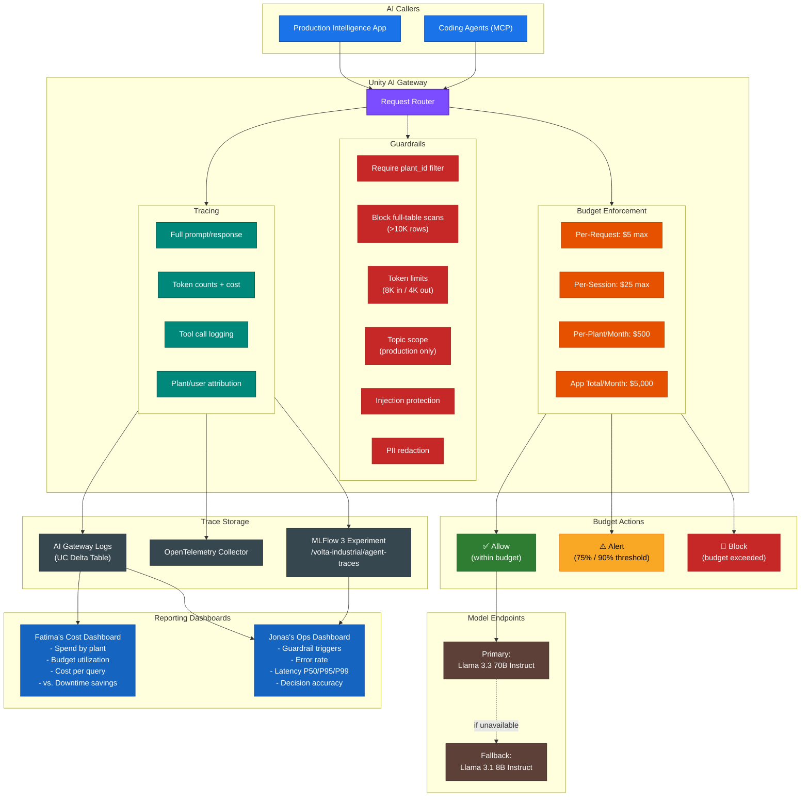

# Volta Industrial — Unity AI Gateway & Cost Governance

```mermaid
flowchart TB
    subgraph Callers["AI Callers"]
        APP["Production Intelligence App"]
        CODE["Coding Agents (MCP)"]
    end

    subgraph Gateway["Unity AI Gateway"]
        direction TB
        ROUTE["Request Router"]
        
        subgraph Budgets["Budget Enforcement"]
            B1["Per-Request: $5 max"]
            B2["Per-Session: $25 max"]
            B3["Per-Plant/Month: $500"]
            B4["App Total/Month: $5,000"]
        end

        subgraph Guards["Guardrails"]
            GR1["Require plant_id filter"]
            GR2["Block full-table scans<br/>(>10K rows)"]
            GR3["Token limits<br/>(8K in / 4K out)"]
            GR4["Topic scope<br/>(production only)"]
            GR5["Injection protection"]
            GR6["PII redaction"]
        end

        subgraph Trace["Tracing"]
            TR1["Full prompt/response"]
            TR2["Token counts + cost"]
            TR3["Tool call logging"]
            TR4["Plant/user attribution"]
        end
    end

    subgraph Models["Model Endpoints"]
        M1["Primary:<br/>Llama 3.3 70B Instruct"]
        M2["Fallback:<br/>Llama 3.1 8B Instruct"]
    end

    subgraph Storage["Trace Storage"]
        MLF["MLFlow 3 Experiment<br/>/volta-industrial/agent-traces"]
        OTEL["OpenTelemetry Collector"]
        LOGS["AI Gateway Logs<br/>(UC Delta Table)"]
    end

    subgraph Dashboards["Reporting Dashboards"]
        D1["Fatima's Cost Dashboard<br/>- Spend by plant<br/>- Budget utilization<br/>- Cost per query<br/>- vs. Downtime savings"]
        D2["Jonas's Ops Dashboard<br/>- Guardrail triggers<br/>- Error rate<br/>- Latency P50/P95/P99<br/>- Decision accuracy"]
    end

    subgraph Actions["Budget Actions"]
        ACT_ALLOW["✅ Allow<br/>(within budget)"]
        ACT_ALERT["⚠️ Alert<br/>(75% / 90% threshold)"]
        ACT_BLOCK["🚫 Block<br/>(budget exceeded)"]
    end

    %% Flow
    APP --> ROUTE
    CODE --> ROUTE
    ROUTE --> Budgets
    ROUTE --> Guards
    Budgets --> ACT_ALLOW
    Budgets --> ACT_ALERT
    Budgets --> ACT_BLOCK
    ACT_ALLOW --> M1
    M1 -.->|"if unavailable"| M2
    ROUTE --> Trace
    Trace --> MLF
    Trace --> OTEL
    Trace --> LOGS
    LOGS --> D1
    LOGS --> D2
    MLF --> D2

    %% Styling
    classDef caller fill:#1a73e8,stroke:#0d47a1,color:#fff
    classDef gateway fill:#7c4dff,stroke:#4a148c,color:#fff
    classDef budget fill:#e65100,stroke:#bf360c,color:#fff
    classDef guard fill:#c62828,stroke:#b71c1c,color:#fff
    classDef trace fill:#00897b,stroke:#004d40,color:#fff
    classDef model fill:#5d4037,stroke:#3e2723,color:#fff
    classDef storage fill:#37474f,stroke:#263238,color:#fff
    classDef dash fill:#1565c0,stroke:#0d47a1,color:#fff
    classDef action_ok fill:#2e7d32,stroke:#1b5e20,color:#fff
    classDef action_warn fill:#f9a825,stroke:#f57f17,color:#000
    classDef action_block fill:#c62828,stroke:#b71c1c,color:#fff

    class APP,CODE caller
    class ROUTE gateway
    class B1,B2,B3,B4 budget
    class GR1,GR2,GR3,GR4,GR5,GR6 guard
    class TR1,TR2,TR3,TR4 trace
    class M1,M2 model
    class MLF,OTEL,LOGS storage
    class D1,D2 dash
    class ACT_ALLOW action_ok
    class ACT_ALERT action_warn
    class ACT_BLOCK action_block
```
