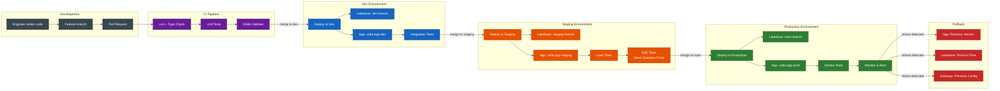

# Volta Industrial — CI/CD & Deployment Pipeline

```mermaid
flowchart LR
    subgraph Dev["Development"]
        DEV_CODE["Engineer writes code"]
        DEV_BRANCH["Feature branch"]
        DEV_PR["Pull Request"]
    end

    subgraph CI["CI Pipeline"]
        LINT["Lint + Type Check"]
        UNIT["Unit Tests"]
        VALIDATE["DABs Validate"]
    end

    subgraph DevDeploy["Dev Environment"]
        DEV_DEPLOY["Deploy to Dev"]
        DEV_LB["Lakebase: dev branch"]
        DEV_APP["App: volta-app-dev"]
        DEV_TEST["Integration Tests"]
    end

    subgraph StagingDeploy["Staging Environment"]
        STG_DEPLOY["Deploy to Staging"]
        STG_LB["Lakebase: staging branch"]
        STG_APP["App: volta-app-staging"]
        STG_LOAD["Load Tests"]
        STG_E2E["E2E Tests<br/>(Hero Question Flow)"]
    end

    subgraph ProdDeploy["Production Environment"]
        PROD_DEPLOY["Deploy to Production"]
        PROD_LB["Lakebase: main branch"]
        PROD_APP["App: volta-app-prod"]
        PROD_SMOKE["Smoke Tests"]
        PROD_MONITOR["Monitor & Alert"]
    end

    subgraph Rollback["Rollback"]
        RB_APP["App: Previous Version"]
        RB_LB["Lakebase: Point-in-Time"]
        RB_GW["Gateway: Previous Config"]
    end

    %% Development flow
    DEV_CODE --> DEV_BRANCH
    DEV_BRANCH --> DEV_PR
    DEV_PR --> LINT
    LINT --> UNIT
    UNIT --> VALIDATE

    %% Dev deployment
    VALIDATE -->|"merge to dev"| DEV_DEPLOY
    DEV_DEPLOY --> DEV_LB
    DEV_DEPLOY --> DEV_APP
    DEV_APP --> DEV_TEST

    %% Staging deployment
    DEV_TEST -->|"merge to staging"| STG_DEPLOY
    STG_DEPLOY --> STG_LB
    STG_DEPLOY --> STG_APP
    STG_APP --> STG_LOAD
    STG_LOAD --> STG_E2E

    %% Production deployment
    STG_E2E -->|"merge to main"| PROD_DEPLOY
    PROD_DEPLOY --> PROD_LB
    PROD_DEPLOY --> PROD_APP
    PROD_APP --> PROD_SMOKE
    PROD_SMOKE --> PROD_MONITOR

    %% Rollback
    PROD_MONITOR -->|"failure detected"| RB_APP
    PROD_MONITOR -->|"failure detected"| RB_LB
    PROD_MONITOR -->|"failure detected"| RB_GW

    %% Styling
    classDef dev fill:#37474f,stroke:#263238,color:#fff
    classDef ci fill:#6a1b9a,stroke:#4a148c,color:#fff
    classDef devenv fill:#1565c0,stroke:#0d47a1,color:#fff
    classDef staging fill:#e65100,stroke:#bf360c,color:#fff
    classDef prod fill:#2e7d32,stroke:#1b5e20,color:#fff
    classDef rollback fill:#c62828,stroke:#b71c1c,color:#fff

    class DEV_CODE,DEV_BRANCH,DEV_PR dev
    class LINT,UNIT,VALIDATE ci
    class DEV_DEPLOY,DEV_LB,DEV_APP,DEV_TEST devenv
    class STG_DEPLOY,STG_LB,STG_APP,STG_LOAD,STG_E2E staging
    class PROD_DEPLOY,PROD_LB,PROD_APP,PROD_SMOKE,PROD_MONITOR prod
    class RB_APP,RB_LB,RB_GW rollback
```
