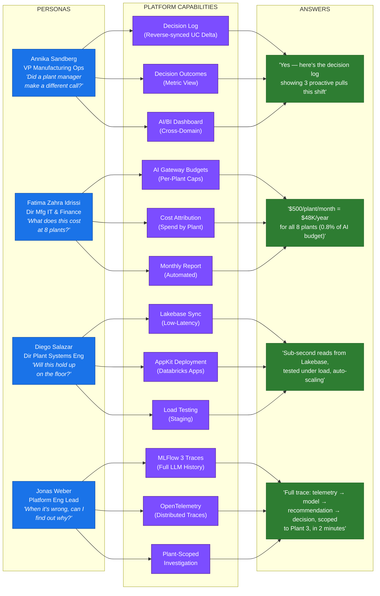

# Volta Industrial — Persona to Capability Mapping

```mermaid
graph LR
    subgraph Personas["PERSONAS"]
        ANNIKA["Annika Sandberg<br/>VP Manufacturing Ops<br/><i>'Did a plant manager<br/>make a different call?'</i>"]
        FATIMA["Fatima Zahra Idrissi<br/>Dir Mfg IT & Finance<br/><i>'What does this cost<br/>at 8 plants?'</i>"]
        DIEGO["Diego Salazar<br/>Dir Plant Systems Eng<br/><i>'Will this hold up<br/>on the floor?'</i>"]
        JONAS["Jonas Weber<br/>Platform Eng Lead<br/><i>'When it's wrong, can I<br/>find out why?'</i>"]
    end

    subgraph Capabilities["PLATFORM CAPABILITIES"]
        CAP1["Decision Log<br/>(Reverse-synced UC Delta)"]
        CAP2["Decision Outcomes<br/>(Metric View)"]
        CAP3["AI/BI Dashboard<br/>(Cross-Domain)"]
        CAP4["AI Gateway Budgets<br/>(Per-Plant Caps)"]
        CAP5["Cost Attribution<br/>(Spend by Plant)"]
        CAP6["Monthly Report<br/>(Automated)"]
        CAP7["Lakebase Sync<br/>(Low-Latency)"]
        CAP8["AppKit Deployment<br/>(Databricks Apps)"]
        CAP9["Load Testing<br/>(Staging)"]
        CAP10["MLFlow 3 Traces<br/>(Full LLM History)"]
        CAP11["OpenTelemetry<br/>(Distributed Traces)"]
        CAP12["Plant-Scoped<br/>Investigation"]
    end

    subgraph Answers["ANSWERS"]
        ANS1["'Yes — here's the decision log<br/>showing 3 proactive pulls this shift'"]
        ANS2["'$500/plant/month = $48K/year<br/>for all 8 plants (0.8% of AI budget)'"]
        ANS3["'Sub-second reads from Lakebase,<br/>tested under load, auto-scaling'"]
        ANS4["'Full trace: telemetry → model →<br/>recommendation → decision, scoped<br/>to Plant 3, in 2 minutes'"]
    end

    %% Annika's path
    ANNIKA --> CAP1
    ANNIKA --> CAP2
    ANNIKA --> CAP3
    CAP1 --> ANS1
    CAP2 --> ANS1
    CAP3 --> ANS1

    %% Fatima's path
    FATIMA --> CAP4
    FATIMA --> CAP5
    FATIMA --> CAP6
    CAP4 --> ANS2
    CAP5 --> ANS2
    CAP6 --> ANS2

    %% Diego's path
    DIEGO --> CAP7
    DIEGO --> CAP8
    DIEGO --> CAP9
    CAP7 --> ANS3
    CAP8 --> ANS3
    CAP9 --> ANS3

    %% Jonas's path
    JONAS --> CAP10
    JONAS --> CAP11
    JONAS --> CAP12
    CAP10 --> ANS4
    CAP11 --> ANS4
    CAP12 --> ANS4

    %% Styling
    classDef persona fill:#1a73e8,stroke:#0d47a1,color:#fff
    classDef capability fill:#7c4dff,stroke:#4a148c,color:#fff
    classDef answer fill:#2e7d32,stroke:#1b5e20,color:#fff

    class ANNIKA,FATIMA,DIEGO,JONAS persona
    class CAP1,CAP2,CAP3,CAP4,CAP5,CAP6,CAP7,CAP8,CAP9,CAP10,CAP11,CAP12 capability
    class ANS1,ANS2,ANS3,ANS4 answer
```
