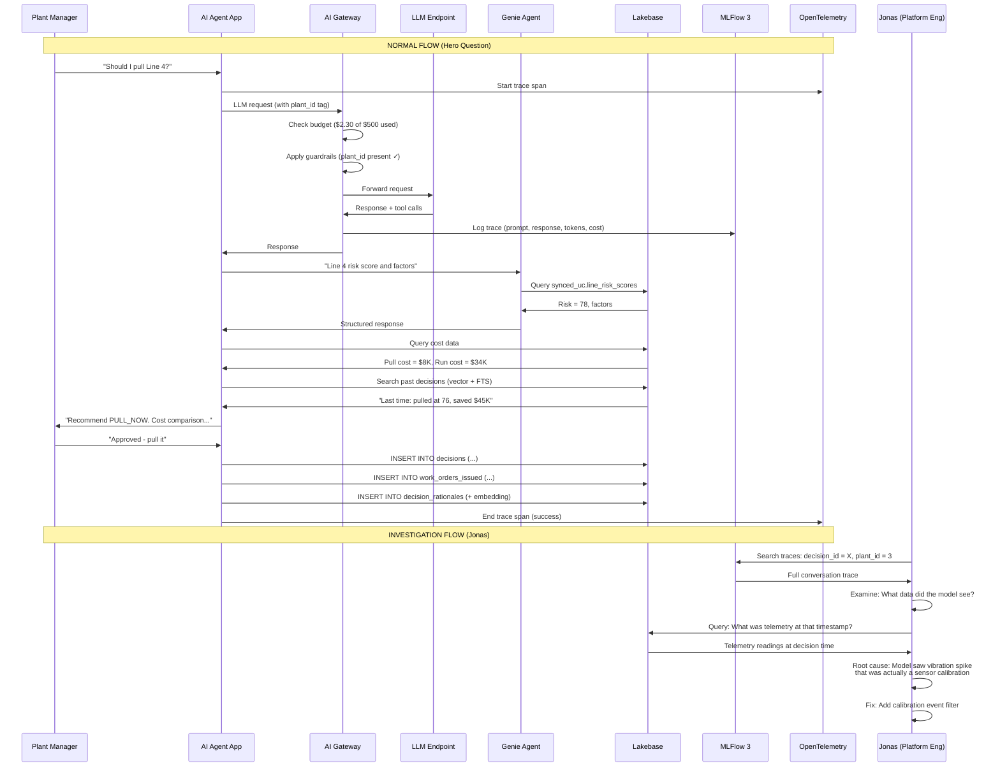

# Volta Industrial — Observability & Investigation Flow

```mermaid
sequenceDiagram
    participant PM as Plant Manager
    participant App as AI Agent App
    participant GW as AI Gateway
    participant LLM as LLM Endpoint
    participant Genie as Genie Agent
    participant LB as Lakebase
    participant MLF as MLFlow 3
    participant OTel as OpenTelemetry

    Note over PM,OTel: NORMAL FLOW (Hero Question)
    
    PM->>App: "Should I pull Line 4?"
    App->>OTel: Start trace span
    App->>GW: LLM request (with plant_id tag)
    GW->>GW: Check budget ($2.30 of $500 used)
    GW->>GW: Apply guardrails (plant_id present ✓)
    GW->>LLM: Forward request
    LLM->>GW: Response + tool calls
    GW->>MLF: Log trace (prompt, response, tokens, cost)
    GW->>App: Response
    
    App->>Genie: "Line 4 risk score and factors"
    Genie->>LB: Query synced_uc.line_risk_scores
    LB->>Genie: Risk = 78, factors
    Genie->>App: Structured response
    
    App->>LB: Query cost data
    LB->>App: Pull cost = $8K, Run cost = $34K
    
    App->>LB: Search past decisions (vector + FTS)
    LB->>App: "Last time: pulled at 76, saved $45K"
    
    App->>PM: "Recommend PULL_NOW. Cost comparison..."
    PM->>App: "Approved - pull it"
    App->>LB: INSERT INTO decisions (...)
    App->>LB: INSERT INTO work_orders_issued (...)
    App->>LB: INSERT INTO decision_rationales (+ embedding)
    App->>OTel: End trace span (success)

    Note over PM,OTel: INVESTIGATION FLOW (Jonas)
    
    participant Jonas as Jonas (Platform Eng)
    
    Jonas->>MLF: Search traces: decision_id = X, plant_id = 3
    MLF->>Jonas: Full conversation trace
    Jonas->>Jonas: Examine: What data did the model see?
    Jonas->>LB: Query: What was telemetry at that timestamp?
    LB->>Jonas: Telemetry readings at decision time
    Jonas->>Jonas: Root cause: Model saw vibration spike<br/>that was actually a sensor calibration
    Jonas->>Jonas: Fix: Add calibration event filter
```
