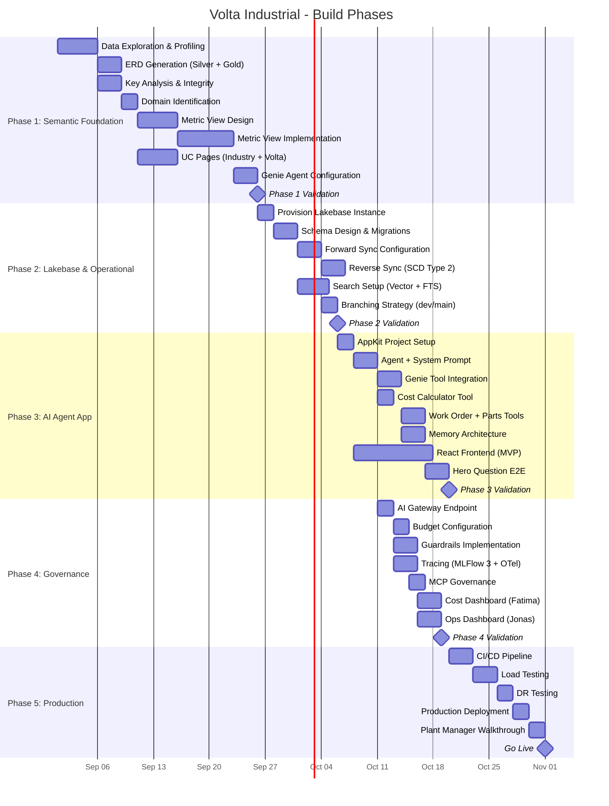

# Volta Industrial — Phased Delivery Timeline

```mermaid
gantt
    title Volta Industrial - Build Phases
    dateFormat  YYYY-MM-DD
    axisFormat  %b %d

    section Phase 1: Semantic Foundation
    Data Exploration & Profiling       :p1a, 2026-09-01, 5d
    ERD Generation (Silver + Gold)     :p1b, after p1a, 3d
    Key Analysis & Integrity           :p1c, after p1a, 3d
    Domain Identification              :p1d, after p1b, 2d
    Metric View Design                 :p1e, after p1d, 5d
    Metric View Implementation         :p1f, after p1e, 7d
    UC Pages (Industry + Volta)        :p1g, after p1d, 5d
    Genie Agent Configuration          :p1h, after p1f, 3d
    Phase 1 Validation                 :milestone, after p1h, 0d

    section Phase 2: Lakebase & Operational
    Provision Lakebase Instance        :p2a, after p1h, 2d
    Schema Design & Migrations         :p2b, after p2a, 3d
    Forward Sync Configuration         :p2c, after p2b, 3d
    Reverse Sync (SCD Type 2)          :p2d, after p2c, 3d
    Search Setup (Vector + FTS)        :p2e, after p2b, 4d
    Branching Strategy (dev/main)      :p2f, after p2c, 2d
    Phase 2 Validation                 :milestone, after p2f, 0d

    section Phase 3: AI Agent App
    AppKit Project Setup               :p3a, after p2f, 2d
    Agent + System Prompt              :p3b, after p3a, 3d
    Genie Tool Integration             :p3c, after p3b, 3d
    Cost Calculator Tool               :p3d, after p3b, 2d
    Work Order + Parts Tools           :p3e, after p3c, 3d
    Memory Architecture                :p3f, after p3c, 3d
    React Frontend (MVP)               :p3g, after p3a, 10d
    Hero Question E2E                  :p3h, after p3e, 3d
    Phase 3 Validation                 :milestone, after p3h, 0d

    section Phase 4: Governance
    AI Gateway Endpoint                :p4a, after p3b, 2d
    Budget Configuration               :p4b, after p4a, 2d
    Guardrails Implementation          :p4c, after p4a, 3d
    Tracing (MLFlow 3 + OTel)          :p4d, after p4a, 3d
    MCP Governance                     :p4e, after p4b, 2d
    Cost Dashboard (Fatima)            :p4f, after p4d, 3d
    Ops Dashboard (Jonas)              :p4g, after p4d, 3d
    Phase 4 Validation                 :milestone, after p4f, 0d

    section Phase 5: Production
    CI/CD Pipeline                     :p5a, after p3h, 3d
    Load Testing                       :p5b, after p5a, 3d
    DR Testing                         :p5c, after p5b, 2d
    Production Deployment              :p5d, after p5c, 2d
    Plant Manager Walkthrough          :p5e, after p5d, 2d
    Go Live                            :milestone, after p5e, 0d
```
