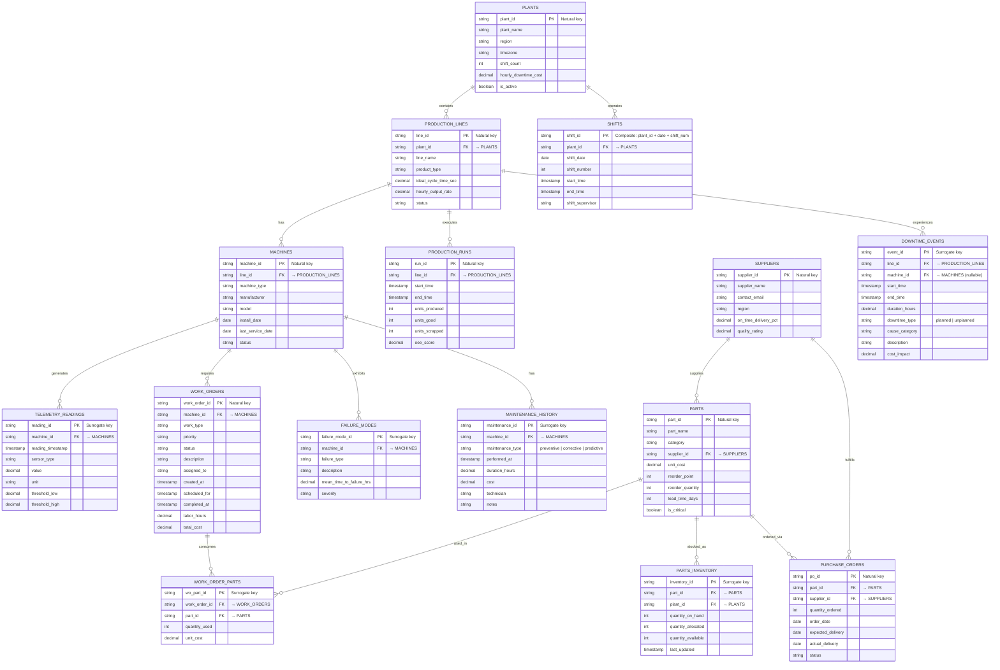

# Volta Industrial — Expected Silver Model ERD

```mermaid
erDiagram
    PLANTS ||--o{ PRODUCTION_LINES : "contains"
    PLANTS ||--o{ SHIFTS : "operates"
    PRODUCTION_LINES ||--o{ MACHINES : "has"
    PRODUCTION_LINES ||--o{ PRODUCTION_RUNS : "executes"
    MACHINES ||--o{ TELEMETRY_READINGS : "generates"
    MACHINES ||--o{ WORK_ORDERS : "requires"
    MACHINES ||--o{ FAILURE_MODES : "exhibits"
    WORK_ORDERS ||--o{ WORK_ORDER_PARTS : "consumes"
    PARTS ||--o{ WORK_ORDER_PARTS : "used_in"
    PARTS ||--o{ PARTS_INVENTORY : "stocked_as"
    SUPPLIERS ||--o{ PARTS : "supplies"
    SUPPLIERS ||--o{ PURCHASE_ORDERS : "fulfills"
    PARTS ||--o{ PURCHASE_ORDERS : "ordered_via"
    PRODUCTION_LINES ||--o{ DOWNTIME_EVENTS : "experiences"
    MACHINES ||--o{ MAINTENANCE_HISTORY : "has"

    PLANTS {
        string plant_id PK "Natural key"
        string plant_name
        string region
        string timezone
        int shift_count
        decimal hourly_downtime_cost
        boolean is_active
    }

    PRODUCTION_LINES {
        string line_id PK "Natural key"
        string plant_id FK "→ PLANTS"
        string line_name
        string product_type
        decimal ideal_cycle_time_sec
        decimal hourly_output_rate
        string status
    }

    MACHINES {
        string machine_id PK "Natural key"
        string line_id FK "→ PRODUCTION_LINES"
        string machine_type
        string manufacturer
        string model
        date install_date
        date last_service_date
        string status
    }

    TELEMETRY_READINGS {
        string reading_id PK "Surrogate key"
        string machine_id FK "→ MACHINES"
        timestamp reading_timestamp
        string sensor_type
        decimal value
        string unit
        decimal threshold_low
        decimal threshold_high
    }

    WORK_ORDERS {
        string work_order_id PK "Natural key"
        string machine_id FK "→ MACHINES"
        string work_type
        string priority
        string status
        string description
        string assigned_to
        timestamp created_at
        timestamp scheduled_for
        timestamp completed_at
        decimal labor_hours
        decimal total_cost
    }

    WORK_ORDER_PARTS {
        string wo_part_id PK "Surrogate key"
        string work_order_id FK "→ WORK_ORDERS"
        string part_id FK "→ PARTS"
        int quantity_used
        decimal unit_cost
    }

    PARTS {
        string part_id PK "Natural key"
        string part_name
        string category
        string supplier_id FK "→ SUPPLIERS"
        decimal unit_cost
        int reorder_point
        int reorder_quantity
        int lead_time_days
        boolean is_critical
    }

    PARTS_INVENTORY {
        string inventory_id PK "Surrogate key"
        string part_id FK "→ PARTS"
        string plant_id FK "→ PLANTS"
        int quantity_on_hand
        int quantity_allocated
        int quantity_available
        timestamp last_updated
    }

    SUPPLIERS {
        string supplier_id PK "Natural key"
        string supplier_name
        string contact_email
        string region
        decimal on_time_delivery_pct
        decimal quality_rating
    }

    PURCHASE_ORDERS {
        string po_id PK "Natural key"
        string part_id FK "→ PARTS"
        string supplier_id FK "→ SUPPLIERS"
        int quantity_ordered
        date order_date
        date expected_delivery
        date actual_delivery
        string status
    }

    PRODUCTION_RUNS {
        string run_id PK "Natural key"
        string line_id FK "→ PRODUCTION_LINES"
        timestamp start_time
        timestamp end_time
        int units_produced
        int units_good
        int units_scrapped
        decimal oee_score
    }

    SHIFTS {
        string shift_id PK "Composite: plant_id + date + shift_num"
        string plant_id FK "→ PLANTS"
        date shift_date
        int shift_number
        timestamp start_time
        timestamp end_time
        string shift_supervisor
    }

    DOWNTIME_EVENTS {
        string event_id PK "Surrogate key"
        string line_id FK "→ PRODUCTION_LINES"
        string machine_id FK "→ MACHINES (nullable)"
        timestamp start_time
        timestamp end_time
        decimal duration_hours
        string downtime_type "planned | unplanned"
        string cause_category
        string description
        decimal cost_impact
    }

    FAILURE_MODES {
        string failure_mode_id PK "Surrogate key"
        string machine_id FK "→ MACHINES"
        string failure_type
        string description
        decimal mean_time_to_failure_hrs
        string severity
    }

    MAINTENANCE_HISTORY {
        string maintenance_id PK "Surrogate key"
        string machine_id FK "→ MACHINES"
        string maintenance_type "preventive | corrective | predictive"
        timestamp performed_at
        decimal duration_hours
        decimal cost
        string technician
        string notes
    }
```
